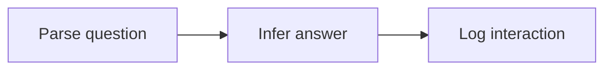

# Semantic Campus Locations

## Objective

Given an SUTD room name or address, return the corresponding SUTD room address or name.

## Data

Let `<` be a beginning-of-sequence (BOS) token, and `>` be an end-of-sequence (EOS) token, and `n` denote a name, and `N` denote a list of names, and `a` denote an address, and `A` denote a list of addresses.

1. Generate raw dataset from [Getting around SUTD](https://sutd.edu.sg/contact-us/getting-around-sutd) by scraping its HTML politely.
2. Generate edge dataset `./data/edges.tsv` from raw dataset by writing each name and address canonically.
3. Craft non-numerical and numerical substitution datasets `./data/nns.csv`, `./data/ns.csv`.
4. Run `python ./data/make.py` to generate augmented (or `python ./data/make.py --no-augment` to generate non-augmented) pre-training and fine-tuning datasets `./data/names.txt`, `./data/addresses.txt`, `./data/n2A.txt`, `./data/a2N.txt` from `./data/edges.tsv`, `./data/nns.csv`, `./data/ns.csv`.

| dataset                | training phase | row content |
| ---------------------- | -------------- | ----------- |
| `./data/names.txt`     | pre-training   | name        |
| `./data/addresses.txt` | pre-training   | address     |
| `./data/n2A.txt`       | fine-tuning    | `n<A>`      |
| `./data/a2N.txt`       | fine-tuning    | `a<N>`      |

## Architecture

Transformer.

## Loss

Cross-entropy.
